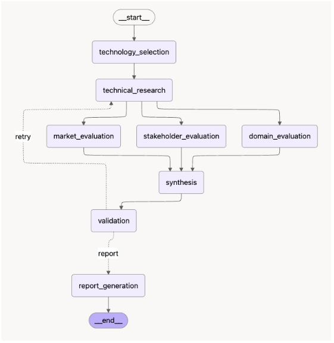

# Subject

본 프로젝트는 KV cache 최적화 기술을 소프트웨어, 하드웨어 두 진영에서 선정하여
시장성·이해관계자·도메인 관점에서 중립적으로 비교 평가하는 Agentic RAG 시스템을
설계·개발한 프로젝트임.

## Overview

- Objective : 데이터센터·클라우드 LLM 서빙에서 KV cache 병목을 해결하는 두 접근(SW/HW)을
  기술 성숙도(TRL), 시장성, 이해관계자, 도메인 적용성 네 관점에서 비교 평가
- Method : LangGraph 기반 Multi-Agent(Fan-out/Fan-in) + Agentic RAG
- Tools : LangGraph, ChromaDB, OpenAI API, PyMuPDF, Tavily/DDGS

## Selected Technologies

- SW : DeepSeek-V2의 MLA(Multi-head Latent Attention) — 저차원 잠재 표현으로 KV cache 자체를
  압축하는 모델 구조 기반 접근. 메모리 사용량을 모델 구조에서 줄이는 방식을 분석하기 위해 선정
- HW : ITME(Inference Tiered Memory Expansion with Disaggregated CXL-Hybrid Memories) —
  CXL-Hybrid 메모리로 저장 계층을 확장하는 인프라 기반 접근. 저장 위치·계층 확장을 통한
  해결 방식을 분석하기 위해 선정
- 선정 방식 : Human-in-the-loop (Agent 자동 선정이 아닌 팀 직접 선정)

## Features

- PDF 원문(DeepSeek-V2, ITME 논문) 기반 근거 추출 — PyMuPDF 파싱, 참고문헌 이후 페이지 제외,
  문자 단위 청킹(최대 900자, 120자 중복), ChromaDB 로컬 벡터 저장소
- Tavily → DDGS → DuckDuckGo HTML 순서의 외부 웹 검색 대체 경로 (시장성·이해관계자 평가용)
- 모든 주요 주장에 evidence_id 연결, 공개 정보 부족 시 "공개 정보 부족"으로 명시
- 확증편향 방지 전략 : 서로 다른 실험 환경의 수치를 직접 우열 비교하지 않음, 기업 홍보 자료와
  독립 검증 결과 구분, 관련 생태계 자료를 해당 기술의 직접 근거로 오인하지 않도록 구분
- 약어 환각 방지 : 소형 로컬 모델이 MLA/ITME/CXL 등 약어를 임의로 잘못 풀어쓰는 것을 막기 위한
  고정 용어집(TERM_GLOSSARY)을 프롬프트에 주입

## Tech Stack

- Framework : LangGraph
- LLM/Generator : OpenAI API `gpt-4o-mini`
- Judge : Python 규칙 기반 검증 함수 (`validation_judge`, LLM 미사용 — 필수 분석 결과 존재 여부,
  evidence_id 등록 여부, 근거 목록 존재 여부를 코드로 검사)
- Retrieval : ChromaDB (Dense Retrieval, 코사인 거리 + 상위 후보 lexical rerank) — `evaluate.py`의 질문별
  `ground_truth_chunk_ids`를 기준으로 Hit@K/MRR을 측정함. 현재 10개 질문의 독립 정답 청크가 등록됨
- Embedding : Ollama 오픈소스 `qwen3-embedding:0.6b` (로컬 실행) — OpenAI API 비용 없이
  논문·질의 임베딩을 생성하며, 모델은 `EMBEDDING_MODEL` 환경변수로 변경 가능

## Agents

- 기술 조사 Agent : 원리·성능·한계·TRL 분석 (논문 RAG)
- 시장성 평가 Agent : 채택·생태계·도입 장벽·경제성 조사 (외부 웹 검색)
- 이해관계자 평가 Agent : 관계자별 기대·우려 조사 (외부 웹 검색)
- 도메인 평가 Agent : 데이터센터·클라우드 적용성 평가 (논문 RAG)
- 종합 평가 Agent : 관점 간 일치·상충·보완 가능성 정리
- 보고서 생성 Agent : 정해진 목차로 최종 보고서 작성
- 그 외 : 초기화 노드(technology_selection, Human이 선정한 기술 확정), 검증 노드(validation)

## Architecture



```
__start__ -> technology_selection -> technical_research
technical_research -> market_evaluation, stakeholder_evaluation, domain_evaluation (Fan-out)
[market_evaluation, stakeholder_evaluation, domain_evaluation] -> synthesis (Fan-in)
synthesis -> validation
validation --retry--> technical_research
validation --report--> report_generation -> __end__
```

전체 mermaid 정의는 설계서 4.4절 참고.

## Directory Structure

```
├── data/                    # 문서 풀 (논문 PDF)
├── agents/                  # Agent 모음 (역할별 분리)
├── config.py                # 환경변수, 경로, 모델·FAST_MODE 상수
├── state.py                 # Evidence, AgentState
├── rag.py                   # 논문 다운로드·파싱·청킹·임베딩·검색
├── llm.py                   # OpenAI API 호출 Helper
├── search.py                # 외부 웹 검색
├── evidence.py               # Evidence 생성·요약·참고문헌 포맷
├── graph.py                  # LangGraph 구성
├── app.py                    # 실행 스크립트
├── evaluate.py                # Retriever 평가 (Hit@K, MRR)
├── outputs/                   # 평가 결과 저장
└── tests/                     # 최소 self-check
```

실행이 끝나면 `outputs/`에 Markdown, HTML, PDF, 상태 JSON 보고서가 자동으로 저장됩니다.

Retriever 평가는 별도로 실행합니다.

```bash
python evaluate.py
```

현재 참고문헌 페이지 제외, 900자 청크, 상위 10개 후보 후 lexical rerank,
로컬 Ollama `qwen3-embedding:0.6b` 기준으로 평가합니다. 임베딩 모델을 변경하면 색인과 정답 ID를 함께 갱신해야 합니다.
평가셋의 `ground_truth_chunk_ids`는 PDF 원문 청크를 직접 확인해 지정하며, 청크 크기나 임베딩 모델을
변경하면 색인과 정답 ID를 함께 갱신해야 합니다.

평가 결과는 전체 Hit@K/MRR뿐 아니라 질문별 rank, 매칭된 청크 ID, 검색 후보 청크 ID를 함께 확인할 수
있도록 구성했습니다. 따라서 검색 실패 질문을 다시 확인하거나 정답 청크·질의·임베딩 설정을 개선할 수 있습니다.

프롬프트는 별도 `prompts/` 디렉토리 대신 각 `agents/*.py` 파일 내부에 함께 관리함
(Agent 로직과 프롬프트를 한 파일에서 같이 보는 편이 유지보수에 더 낫다고 판단).

## Usage

```bash
brew install pango
pip install -r requirements.txt
cp .env.example .env   # OPENAI_API_KEY와 EMBEDDING_MODEL 확인
# 선택: TAVILY_API_KEY를 입력하지 않으면 DuckDuckGo로 자동 대체
python app.py
```

`config.py`의 `FAST_MODE`는 빠른 구조 확인과 최종 실행을 구분합니다.

- `FAST_MODE=True` : 재시도 없이 실행하고 검색 결과 수와 보고서 입력을 줄입니다. 도메인 평가 기준도
  하나의 통합 질의로 축약해 빠르게 Graph 동작을 확인합니다.
- `FAST_MODE=False` : 최대 2회 재시도, Agent당 검색 5개, 도메인 평가 기준별 질의로 실행합니다.

제출용 최종 보고서는 `FAST_MODE = False`로 생성하세요.

## Contributors

아래 역할은 포크 `hyc`의 현용찬 커밋과 원본 `main`에 반영된 팀원별 기능 커밋을
변경 파일과 커밋 내용을 기준으로 정리했습니다.

| 팀원 | 주요 역할 | 주요 변경 영역 | 근거 커밋 |
| --- | --- | --- | --- |
| P209 곽민규 | 이해관계자 평가 Agent 담당 | `agents/stakeholder_evaluation.py`의 질의 템플릿 분리 및 보완 | `499e608` |
| P213 김선정 | Agentic RAG 통합 및 종합·검증·보고서 담당 | OpenAI API 연동, 임베딩·재현성 개선, `agents/synthesis.py`의 종합 평가·Judge·보고서 생성 | `665a43a`, `ac9403a`, `777a720`, `8a26658` |
| P229 이지원 | 시장성 평가 Agent 담당 | `agents/market_evaluation.py` 리팩토링 및 시장성 조사 흐름 보완 | `fefa828` |
| P231 임유리 | 기술 선정 및 기술 조사 Agent 담당 | `agents/technology_selection.py`, `agents/technical_research.py`의 기술·TRL 분석 명세 보완 | `52a9e01` |
| P240 현용찬 | Retriever 평가 및 도메인 평가 담당, 발표·통합 | `evaluate.py`의 정답 청크·재정렬 평가 , `agents/domain_evaluation.py`의 기술별 도메인 질의 구조 정리 | `cbfb7da` |

각 Agent는 독립된 역할을 수행하지만, 최종 결과는 LangGraph의 State와
Fan-out/Fan-in 흐름을 통해 하나의 평가 보고서로 통합됩니다.
