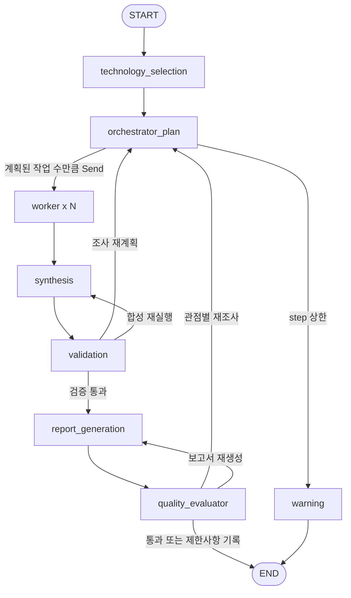

# Subject

본 프로젝트는 KV cache 최적화 기술을 소프트웨어와 하드웨어 진영에서 각각 선정하고, 기술 성숙도·시장성·이해관계자·도메인 적용성을 비교 평가하는 **Orchestrator-Workers 기반 Agentic RAG 시스템**임. 기술의 승자를 정하기보다 적용 조건, 기대 효과, 제약과 공개 근거의 한계를 정리함.

## Overview

- Objective : 데이터센터·클라우드 LLM 서빙의 KV cache 병목을 해결하는 SW/HW 기술을 네 관점에서 비교 평가함.
- Pattern : Orchestrator-Workers — 관점별 조사를 병렬 수행하고 결과를 종합하는 과제에 맞춰 계획 → Worker 실행 → 합성 흐름을 선택함.
- 동적 처리 : 실행 때 요청문과 `retry_targets`를 바탕으로 작업 계획을 생성함. 계획에 포함된 작업 수만큼만 Worker를 실행하며, 근거 보완이 필요하면 해당 관점의 Worker만 다시 계획함. 모든 Worker를 매번 실행하는 고정 fan-out과 구분됨.
- 기본 요청은 기술 성숙도(TRL), 시장성, 이해관계자, 도메인 적용성 네 관점을 포함함. 일부 관점만 요청해 Worker 수가 달라지는 동작도 확인할 수 있음.

## Selected Technologies

- SW : **DeepSeek-V2 MLA(Multi-head Latent Attention)** — KV를 저차원 잠재 표현으로 압축하는 모델 구조 기반 접근임. KV cache의 크기를 줄이는 소프트웨어 측 해결 방식을 분석하기 위해 선정함.
- HW : **ITME(Inference Tiered Memory Expansion with Disaggregated CXL-Hybrid Memories)** — CXL-Hybrid 메모리의 계층·분리 구조를 활용하는 인프라 접근임. KV cache를 저장하는 메모리 용량과 계층을 확장하는 하드웨어 측 해결 방식을 분석하기 위해 선정함.
- 두 기술은 팀에서 직접 선정함. `technology_selection` 노드는 선정 결과를 State에 설정하며, LLM이 후보 기술을 자동 선정하지는 않음.
- 모델 구조 변경과 메모리 인프라 변경은 실험 조건이 다르므로 수치를 동일 조건의 직접 비교 결과로 해석하지 않음.

## Features

- 논문 PDF를 PyMuPDF로 파싱하고, 참고문헌 이후를 제외해 900자 청크·120자 중복으로 나눈 뒤 ChromaDB에서 검색함.
- 시장성·이해관계자 조사는 Tavily를 우선 사용하고 DDGS, DuckDuckGo HTML을 대체 경로로 사용함.
- 분석 중에는 원본 `evidence_id`를 유지하고, 최종 보고서에서는 같은 논문·URL의 근거를 번호 인용으로 묶어 `citation_map`으로 연결함.
- 계획된 Worker만 병렬 실행하고 reducer로 결과를 합침. Worker 실패는 `continue_with_limitations` 정책으로 기록하며, 부족한 관점은 재조사할 수 있음.
- 공식·독립 출처를 구분하고, 출처 다양성·집중도·도메인 수·등급을 검사해 편향과 신뢰도 문제를 확인함.
- 보고서 생성 후 근거 연결, 중립성, 편향 통제, 관점 커버리지, 목차와 분량을 평가함. 결과에 따라 Worker 재조사 또는 보고서 재생성으로 분기함.
- `TERM_GLOSSARY`를 각 Agent 프롬프트에 전달해 MLA·ITME·CXL 약어가 임의로 해석되는 것을 줄임.

품질 검사는 Python 규칙 기반임. 인용 ID의 연결과 문서 구조를 검사하지만, 출처가 실제 주장의 의미를 뒷받침하는지까지 보장하지는 않으므로 최종 보고서는 원문과 함께 검토해야 함.

## Tech Stack

- Framework : LangGraph
- LLM/Generator : OpenAI API `gpt-4o-mini` 기본값 (`OPENAI_MODEL`로 변경)
- LLM/Judge : 별도 LLM Judge는 사용하지 않음. `validation_judge`와 `quality_evaluator_node`에서 Python 규칙으로 판정함.
- Retrieval : ChromaDB dense 검색과 lexical rerank를 사용함. 정답 청크가 등록된 10개 질문을 `evaluate.py`에서 평가하며, 실행 결과로 **Hit Rate@5(Hit@5), MRR**과 질문별 정답 순위를 확인함.
- Embedding : Ollama의 오픈소스 `qwen3-embedding:0.6b` 기본값 (`EMBEDDING_MODEL`로 변경)
- PDF/Report : PyMuPDF, Markdown, WeasyPrint
- Web Search : Tavily / DDGS / DuckDuckGo HTML

Ollama는 논문과 질문의 **임베딩 생성**에 사용함. 분석과 보고서 작성은 OpenAI API가 담당하며, Ollama를 생성 모델이나 LLM Judge로 사용하는 구성은 아님.

## Agents

| 구성 요소 | 역할 | 구현 위치 |
| --- | --- | --- |
| Technology Selection | 팀이 선정한 SW/HW 기술을 State에 설정 | `agents/technology_selection.py` |
| Orchestrator | 요청별 작업 계획, dynamic fan-out, 재조사 대상 재계획 | `graph.py` |
| Technical Research | 논문 근거로 원리·성능·한계·TRL 조사 | `agents/technical_research.py` |
| Market Evaluation | 채택·생태계·도입 장벽 등 시장성 조사 | `agents/market_evaluation.py` |
| Stakeholder Evaluation | 관계자별 기대·우려와 근거 조사 | `agents/stakeholder_evaluation.py` |
| Domain Evaluation | 데이터센터·클라우드 LLM 서빙 적용성 조사 | `agents/domain_evaluation.py` |
| Synthesizer | 관점별 결과의 일치·상충·보완 가능성 종합 | `agents/synthesis.py` |
| Validation | 보고서 생성 전 분석 결과와 근거 연결 검사 | `agents/synthesis.py` |
| Report Generation | 정해진 목차로 보고서 작성, 숫자 인용·REFERENCE 구성 | `agents/synthesis.py` |
| Quality Evaluator | 생성 후 품질 평가, 재조사·재생성·종료 판단 | `graph.py` |

## State Schema

설계는 `state.py:AgentState`와 `Evidence`에 정의함. 제어 메타데이터와 작업 페이로드는 같은 State 안에서 필드 역할로 구분함.

| 항목 | 설계 근거와 현재 구현 |
| --- | --- |
| 제어 vs 페이로드 분리 | 계획·라우팅에는 `plan`, `required_task_ids`, `current_task`, `status`, `step_count`, `retry_targets`, 재시도 횟수를 사용함. 분석 결과, `references`, `synthesis`, `report`, `citation_map`은 작업 페이로드임. |
| 관측성 위치 | 계획, 실패 처리, 품질 판정과 사유를 `decision_log`에 남김. 실행 결과는 State JSON으로 저장하고, LangGraph 실행 흐름은 LangSmith 환경변수를 설정해 외부에서 확인함. 현재 결정 로그는 State 내부에 보관하는 설계임. |
| 지속성 비용 | PDF 원본과 벡터 저장소는 `data/`에서 관리함. State에는 ID·페이지·URL뿐 아니라 검색한 `evidence_text`도 포함함. 논문 청크·웹 URL 기준 중복 제거와 반복 상한으로 증가를 제한하지만, State 크기의 별도 바이트 상한이나 오래된 로그 삭제는 구현하지 않음. |
| 상관 | 실행마다 UUID `trace_id`를 생성해 State와 저장 결과의 실행 메타데이터에 남김. 현재 코드는 이 값을 LangSmith 루트 `run_id`로 직접 지정하지 않으므로 두 ID가 같다고 가정하지 않음. |
| 재개/복구 | `task_results`의 상태와 `errors`, `retry_targets`, `retry_count`, `report_retry_count`로 실행 중 재시도를 판단함. 실패한 Worker를 기록하고 처리를 계속할 수 있으나, checkpointer와 저장 State를 읽는 재개 기능은 없어 프로세스 종료 후 자동 복구는 지원하지 않음. |
| 동시 처리 | `task_results`는 `task_id` 기준으로 최신 결과를 병합함. `references`는 논문 기술명·청크 ID 또는 웹 URL 기준으로 중복 제거하며, `decision_log`와 `errors`는 누적 reducer로 합침. |
| 종료 보장 | `max_steps`와 `MAX_RETRIES`, 별도의 보고서 재시도 횟수, LangGraph `recursion_limit`으로 반복을 제한함. 품질 통과 시 정상 종료하고, 재시도 소진 시 `pass_with_limitations`·`warning`으로 한계를 남기고 종료함. 제한 종료를 품질 통과로 해석하지 않음. |

`Evidence`의 `source_tier`, `source_category`, `publisher`, `is_independent`는 출처 정보를 보존함. `citation_map`은 숫자 인용을 원본 근거 ID 목록으로 역추적하는 데 사용함.

## Architecture



```mermaid
flowchart TD
    A([START]) --> B[technology_selection]
    B --> C[orchestrator_plan]
    C -->|계획된 작업 수만큼 Send| D[worker x N]
    C -->|step 상한| W[warning]
    D --> E[synthesis]
    E --> F[validation]
    F -->|조사 재계획| C
    F -->|합성 재실행| E
    F -->|검증 통과| G[report_generation]
    G --> H[quality_evaluator]
    H -->|관점별 재조사| C
    H -->|보고서 재생성| G
    H -->|통과 또는 제한사항 기록| I([END])
    W --> I
```

Worker는 각자 분석 결과를 State에 반환하고 Synthesizer가 이를 종합함. Worker 간 직접 호출은 없으며 Orchestrator가 실행 계획과 재작업 대상을 정함.

## Directory Structure

```text
├── data/                    # 실행 시 생성: 논문 PDF와 ChromaDB
├── agents/                  # 관점별 Agent 및 종합·검증·보고서 프롬프트
├── docs/                    # 아키텍처 이미지, 로컬 실행 기록, 참고 보고서
├── outputs/                 # 생성 보고서와 실행 State
├── tests/                   # 비-LLM 로직 smoke test
├── config.py                # 모델·경로·검색·출처 분류·실행 모드 설정
├── state.py                 # State, Evidence, reducer
├── rag.py                   # 논문 수집·파싱·청킹·임베딩·검색
├── llm.py                   # OpenAI JSON/텍스트 호출
├── search.py                # 웹 검색 및 출처 분류
├── evidence.py              # 근거 구성·인용 번호·참고문헌 처리
├── graph.py                 # 계획·Worker 실행·품질 평가·조건부 분기
├── evaluate.py              # Hit@5, MRR 평가
├── app.py                   # 파이프라인 실행·산출물 검증·PDF 저장
├── requirements.txt         # Python 의존성
├── .env.example             # 환경변수 예시
└── README.md
```

별도 `prompts/` 디렉토리는 사용하지 않음. 각 Agent의 프롬프트는 해당 `agents/*.py`에서 로직과 함께 관리함.

## Usage

저장소 루트에서 실행함. Python 환경, Ollama 서버, OpenAI API 키가 필요함. macOS에서 WeasyPrint 사용을 위한 시스템 의존성 설치 예시는 다음과 같음.

```bash
brew install pango
python3 -m venv .venv
source .venv/bin/activate
pip install -r requirements.txt
cp .env.example .env
```

기존 `.env`가 있으면 복사로 덮어쓰지 말고 필요한 항목만 확인함. `.env`에 `OPENAI_API_KEY`, `OPENAI_MODEL`, `EMBEDDING_MODEL`, `OLLAMA_HOST`, `FAST_MODE`를 설정함. `TAVILY_API_KEY`는 선택 사항이며 없으면 웹 검색 대체 경로를 사용함.

Ollama 서버를 실행한 상태에서 임베딩 모델을 준비함.

```bash
ollama pull qwen3-embedding:0.6b
python tests/test_smoke.py
python app.py
```

- `FAST_MODE=true` : 빠른 구조 확인용임. 재시도 없이 RAG 질의당 2건, 웹 검색당 최대 1건을 사용하고 보고서 입력을 축소함.
- `FAST_MODE=false` : 제출용 실행임. 재시도 한도는 2회이며, RAG 질의당 상위 5건, 웹 검색당 최대 4건을 사용함.
- `--request` 생략 : 기본 요청의 네 관점을 모두 조사함.

Dynamic fan-out 비교와 Retriever 평가 명령은 다음과 같음.

```bash
python app.py --request "DeepSeek-V2 MLA와 ITME의 기술 성숙도와 도메인 적용성을 비교 평가하라."
python evaluate.py
```

`evaluate.py`는 후보를 최소 10개 검색하고 재정렬한 상위 5개를 평가함. 결과는 콘솔에 Hit@5, MRR, 질문별 최초 정답 순위와 청크 ID로 출력됨. 청킹을 변경하면 정답 청크 ID를 다시 검증하고, 임베딩 모델을 변경하면 색인을 다시 생성함.

실행 결과는 `outputs/`에 Markdown·HTML·PDF·State JSON으로 저장됨. 보고서는 `SUMMARY`, 분석 배경, 기술 선정, 기술 개요, 관점별 평가, 관점별 비교 및 상충 지점, 시사점, 분석의 한계, `REFERENCE`로 구성함. PDF 저장 후 페이지 수를 검사하고 10장을 초과하면 오류를 냄. 자동으로 10장에 맞춰 축약하는 기능은 아님.

기존 `agent_evaluation_report.*`는 코드 구조 점검 문서이고, `kv_cache_report_baseline.*`는 이전 RAG 결과 기준본임.

## Contributors

| 팀원 | 주요 기여 | 대표 커밋 |
| --- | --- | --- |
| 곽민규 | 이해관계자 조사 질의를 정리하고, LLM 호출 시 API 키 미설정 검사를 보완함 | [499e608](https://github.com/Seonjeongg/kv_cache_agent_rag/commit/499e608), [b086ec1](https://github.com/Seonjeongg/kv_cache_agent_rag/commit/b086ec1) |
| 김선정 | RAG·모델 연동을 구성하고, 종합 평가·보고서 품질을 개선함 | [777a720](https://github.com/Seonjeongg/kv_cache_agent_rag/commit/777a720), [91870bb](https://github.com/Seonjeongg/kv_cache_agent_rag/commit/91870bb) |
| 이지원 | 시장성 조사 흐름을 정리하고, 참고문헌 묶음·페이지 표시를 보완함 | [fefa828](https://github.com/Seonjeongg/kv_cache_agent_rag/commit/fefa828), [be7f2e0](https://github.com/Seonjeongg/kv_cache_agent_rag/commit/be7f2e0) |
| 임유리 | 기술·TRL 조사 명세를 정리하고, 보고서 중립성·근거 표시를 보완함 | [52a9e01](https://github.com/Seonjeongg/kv_cache_agent_rag/commit/52a9e01), [2e7167d](https://github.com/Seonjeongg/kv_cache_agent_rag/commit/2e7167d) |
| 현용찬 | 도메인 평가를 보완하고, 동적 실행 흐름·보고서 검증을 통합함 | [cbfb7da](https://github.com/Seonjeongg/kv_cache_agent_rag/commit/cbfb7da), [5c8b101](https://github.com/Seonjeongg/kv_cache_agent_rag/commit/5c8b101) |
