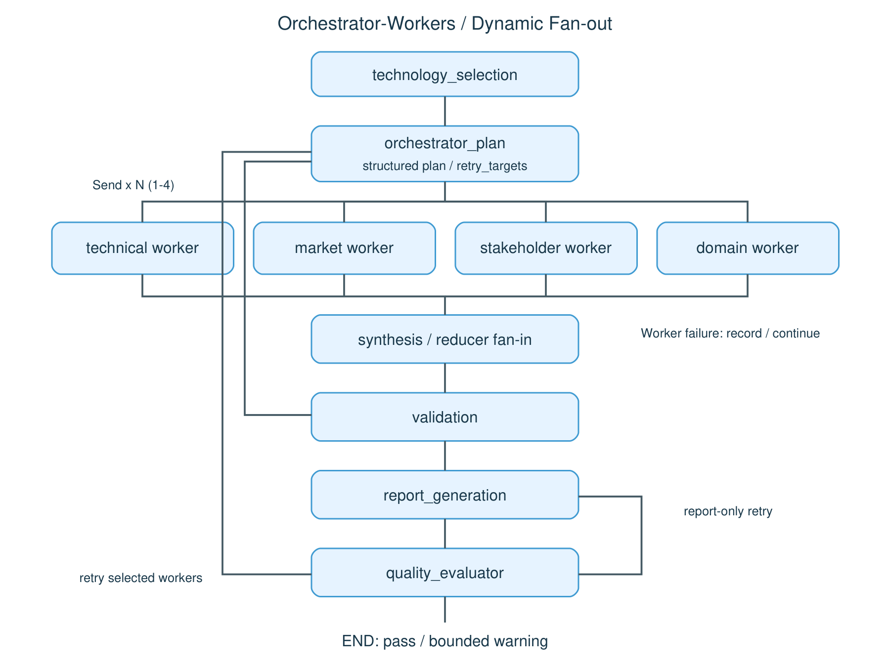

# Subject

본 프로젝트는 KV cache 최적화 기술을 소프트웨어, 하드웨어 두 진영에서 선정하여
시장성·이해관계자·도메인 관점에서 중립적으로 비교 평가하는 Agentic RAG 시스템을
설계·개발한 프로젝트임.

## Overview

- Objective : 데이터센터·클라우드 LLM 서빙에서 KV cache 병목을 해결하는 두 접근(SW/HW)을
  기술 성숙도(TRL), 시장성, 이해관계자, 도메인 적용성 네 관점에서 비교 평가
- Method : LangGraph 기반 Orchestrator-Workers(Dynamic Fan-out/Fan-in) + Agentic RAG
- Pattern : Orchestrator-Workers — 실행 전 subtask를 계획하고 Worker 결과를 병렬 취합
- 동적 처리 : `plan`의 실제 task 수만큼 `Send` fan-out, 품질 미달 시 `retry_targets`만 재계획
- 실행 로그에 `[PLAN]`과 `[FAN-OUT]`을 남겨 요청별 Worker 수와 재시도 대상이 달라지는지 확인
- Tools : LangGraph, ChromaDB, OpenAI API, PyMuPDF, Tavily/DDGS

## Selected Technologies

- SW : DeepSeek-V2의 MLA(Multi-head Latent Attention) — 저차원 잠재 표현으로 KV cache 자체를
  압축하는 모델 구조 기반 접근. 메모리 사용량을 모델 구조에서 줄이는 방식을 분석하기 위해 선정
- HW : ITME(Inference Tiered Memory Expansion with Disaggregated CXL-Hybrid Memories) —
  CXL-Hybrid 메모리로 저장 계층을 확장하는 인프라 기반 접근. 저장 위치·계층 확장을 통한
  해결 방식을 분석하기 위해 선정
- 선정 방식 : Human-in-the-loop (Agent 자동 선정이 아닌 팀 직접 선정)

## Features

- PDF 원문(DeepSeek-V2, ITME 논문) 기반 근거 추출 — PyMuPDF 파싱, 참고문헌 이후 페이지 제외,
  문자 단위 청킹(최대 900자, 120자 중복), ChromaDB 로컬 벡터 저장소
- Tavily → DDGS → DuckDuckGo HTML 순서의 외부 웹 검색 대체 경로 (시장성·이해관계자 평가용)
- 최종 보고서의 핵심 주장에 `[evidence_id]`를 직접 표시하고, 본문에 실제 표시된 ID만 `REFERENCE`에 연결
- 실행 시점에 구조화한 subtask를 `Send`로 동적 fan-out하고 worker 결과를 reducer로 fan-in
- worker 실패 시 `continue_with_limitations` 정책으로 합성을 계속하고 실패·한계를 State에 기록
- 보고서 생성 후 quality evaluator가 필수 구조·근거 연결·중립성·4개 관점 커버리지를 검사하고 미달 시 retry loop
- 잘못된 evidence가 특정 관점에서 발견되면 해당 Worker만 재실행하고, 전체 계획을 다시 실행하지 않음
- 품질 평가에 편향 통제를 포함 — 관점별 서로 다른 출처 2개 이상, 단일 출처 인용 비중 50% 이하를 검사
- 확증편향 방지 전략 : 서로 다른 실험 환경의 수치를 직접 우열 비교하지 않음, 기업 홍보 자료와
  독립 검증 결과 구분, 관련 생태계 자료를 해당 기술의 직접 근거로 오인하지 않도록 구분
- 약어 환각 방지 : 소형 로컬 모델이 MLA/ITME/CXL 등 약어를 임의로 잘못 풀어쓰는 것을 막기 위한
  고정 용어집(TERM_GLOSSARY)을 프롬프트에 주입

## Tech Stack

- Framework : LangGraph
- LLM/Generator : OpenAI API `gpt-4o-mini`
- Judge : Python 규칙 기반 검증 함수 (`validation_judge`, `quality_evaluator_node`) — 필수 분석 결과,
  evidence_id 연결, 출처 다양성·단일 출처 집중도, 필수 목차, 중립성, 관점 커버리지를 코드로 검사
- Retrieval : ChromaDB (Dense Retrieval, 코사인 거리 + 상위 후보 lexical rerank) — `evaluate.py`의 질문별
  `ground_truth_chunk_ids`를 기준으로 Hit@K/MRR을 측정함. 현재 10개 질문의 독립 정답 청크가 등록됨
  - 2026-10-07 재실행: Hit@5 = 0.50, MRR = 0.3833 (10문항). `outputs/retrieval_metrics.json`에 질문별 결과를 저장했다. 검색 실패 5문항은 개선 과제로 남긴다.
- Embedding : Ollama 오픈소스 `qwen3-embedding:0.6b` (로컬 실행) — OpenAI API 비용 없이
  논문·질의 임베딩을 생성하며, 모델은 `EMBEDDING_MODEL` 환경변수로 변경 가능

## Agents

- 기술 조사 Agent : 원리·성능·한계·TRL 분석 (논문 RAG)
- 시장성 평가 Agent : 채택·생태계·도입 장벽·경제성 조사 (외부 웹 검색)
- 이해관계자 평가 Agent : 관계자별 기대·우려 조사 (외부 웹 검색)
- 도메인 평가 Agent : 데이터센터·클라우드 적용성 평가 (논문 RAG)
- 종합 평가 Agent : 관점 간 일치·상충·보완 가능성 정리
- 보고서 생성 Agent : 정해진 목차로 최종 보고서 작성
- Orchestrator : 실행 시 subtask 계획·동적 fan-out·재시도 대상 재계획
- Quality Evaluator : 보고서 생성 후 구조·근거·중립성·관점 커버리지 검사
- 그 외 : 초기화 노드(technology_selection, Human이 선정한 기술 확정), 검증 노드(validation)

## Architecture



```
__start__ -> technology_selection -> orchestrator_plan
orchestrator_plan --Send(plan.subtasks)--> worker x N (dynamic fan-out)
worker x N -> synthesis (fan-in) -> validation -> report_generation
report_generation -> quality_evaluator
quality_evaluator --retry--> orchestrator_plan (retry_targets만 재계획)
quality_evaluator --report-retry--> report_generation (문서 형식·중립성만 재생성)
quality_evaluator --pass--> __end__
```

전체 mermaid 정의는 설계서 4.4절 참고.

## Directory Structure

```
├── data/                    # 문서 풀 (논문 PDF)
├── agents/                  # Agent 모음 (역할별 분리)
├── config.py                # 환경변수, 경로, 모델·FAST_MODE 상수
├── state.py                 # Evidence, AgentState
├── rag.py                   # 논문 다운로드·파싱·청킹·임베딩·검색
├── llm.py                   # OpenAI API 호출 Helper
├── search.py                # 외부 웹 검색
├── evidence.py               # Evidence 생성·요약·참고문헌 포맷
├── graph.py                  # 동적 Orchestrator·Worker·품질 Loop 구성
├── app.py                    # 실행 스크립트
├── evaluate.py                # Retriever 평가 (Hit@K, MRR)
├── outputs/                   # 평가 결과 저장
└── tests/                     # 최소 self-check
```

실행이 끝나면 `outputs/`에 Markdown, HTML, PDF, 상태 JSON 기술 평가 보고서가 자동으로 저장됩니다. `agent_evaluation_report.*`는 코드 구조 점검용 별도 문서이고, `kv_cache_report_baseline.*`는 실제 재실행 전까지 보관하는 기존 RAG 결과 기준본입니다.
최종 PDF 저장 시 페이지 수를 검사하며 10장을 초과하면 제출 전에 오류로 중단합니다. 원문 evidence는 State에 보존하되, 최종 `REFERENCE`는 동일 논문 파일·동일 웹 URL을 하나의 출처로 묶어 표시합니다. 같은 논문에서 여러 페이지가 사용되면 `(pp.3, 8, 21)`처럼 페이지를 합산해 표시합니다.

## LangSmith Tracing

### 개인 브랜치 실행 확인 (2026-10-07)

- `python tests/test_smoke.py`: 31개 통과.
- 전체 실행: `f3fd6a94-ab27-4fbe-b0a2-26425a1abdba`. 네 Worker 실행 후 품질 미달 관점만 재조사했다.
- `outputs/kv_cache_report_20261007_163041.pdf`는 4장이며, 최종 상태는 `warning / pass_with_limitations`다. 중립성 검사에 남은 표현이 있어 제출 완료본으로 간주하지 않는다.
- 로컬 `docs/tracing-1.png`는 앞선 실행 `5041cb86-4165-46c9-9953-4e886db7db62`의 실제 LangSmith 화면이다. 최종 통과 증빙이 아니며 계정 정보가 표시되어 Git 업로드에서 제외했다.
- `outputs/fanout_demo.json`: 두 Worker 실행 확인용 결과이며, 보고서 생성 전 의도적으로 중단한 별도 실험이다.
- 이 브랜치의 실행 추적 보완은 최신 dev의 숫자 인용·출처 등급 코드와 아직 통합하지 않았다. 파일 전체를 덮어쓰지 않는다.

실행 trace를 제출할 때는 다음 환경변수를 설정한 뒤 실제 실행 화면을 캡처하세요.

```bash
# .env에 아래 값을 저장 (키는 Git에 올리지 않음)
# LANGSMITH_TRACING=true
# LANGSMITH_API_KEY=발급받은 키
# LANGSMITH_PROJECT=skala
python app.py
# 예시: 기술 성숙도와 도메인 적용성만 조사해 2개 Worker 계획 확인
python app.py --request "DeepSeek-V2 MLA와 ITME의 기술 성숙도와 도메인 적용성을 비교 평가하라."
# 기존 색인으로 두 Worker만 실제 실행 (보고서 생성 전 의도적으로 정지)
python demo_fanout.py
```

`trace_id`를 그래프의 root run_id 및 metadata에도 전달한다. OpenAI 호출은 `wrap_openai`로 감싸 모델 호출을 하위 run으로 남긴다. 로컬에는 `outputs/execution_{trace_id}.jsonl`로 노드 시작·종료와 분기 사유를 저장한다. API 키가 없으면 로컬 기록만 생성하며, 이것을 LangSmith 제출물로 간주하지 않는다. 실제 LangSmith 화면을 `tracing-1.png`, `tracing-2.png`로 제출한다.

Retriever 평가는 별도로 실행합니다.

```bash
python evaluate.py
# 기존 색인으로 평가하려면 (app.py와 동시에 색인을 재생성하지 않음)
python evaluate.py --reuse-index
```

현재 참고문헌 페이지 제외, 900자 청크, 상위 10개 후보 후 lexical rerank,
로컬 Ollama `qwen3-embedding:0.6b` 기준으로 평가합니다. 임베딩 모델을 변경하면 색인과 정답 ID를 함께 갱신해야 합니다.
평가셋의 `ground_truth_chunk_ids`는 PDF 원문 청크를 직접 확인해 지정하며, 청크 크기나 임베딩 모델을
변경하면 색인과 정답 ID를 함께 갱신해야 합니다.

평가 결과는 전체 Hit@K/MRR뿐 아니라 질문별 rank, 매칭된 청크 ID, 검색 후보 청크 ID를 함께 확인할 수
있도록 구성했습니다. 따라서 검색 실패 질문을 다시 확인하거나 정답 청크·질의·임베딩 설정을 개선할 수 있습니다.

프롬프트는 별도 `prompts/` 디렉토리 대신 각 `agents/*.py` 파일 내부에 함께 관리함
(Agent 로직과 프롬프트를 한 파일에서 같이 보는 편이 유지보수에 더 낫다고 판단).

## Usage

```bash
brew install pango
pip install -r requirements.txt
cp .env.example .env   # OPENAI_API_KEY와 EMBEDDING_MODEL 확인
# 선택: TAVILY_API_KEY를 입력하지 않으면 DuckDuckGo로 자동 대체
python app.py
```

`config.py`의 `FAST_MODE`는 빠른 구조 확인과 최종 실행을 구분합니다.

- `FAST_MODE=True` : 재시도 없이 실행하고 검색 결과 수와 보고서 입력을 줄입니다. 도메인 평가 기준도
  하나의 통합 질의로 축약해 빠르게 Graph 동작을 확인합니다.
- `FAST_MODE=False` : 최대 2회 재시도, Agent당 검색 5개, 도메인 평가 기준별 질의로 실행합니다.

`--request`를 생략하면 네 관점을 모두 포함한 기본 요청으로 실행합니다. 요청문에 시장성·이해관계자·도메인·기술 성숙도 관점을 포함하거나 제외하면 Orchestrator가 실행할 Worker 수를 달리 계획합니다. 품질 평가에서 특정 관점의 잘못된 evidence가 발견되면 해당 Worker만 `retry_targets`로 재계획합니다.

제출용 최종 보고서는 `FAST_MODE = False`로 생성하세요.
부분 관점 요청과 `demo_fanout.py`는 동적 처리 확인용이다. 제출 보고서는 `--request` 없이 네 관점으로 생성하며, 최종 품질 결과의 `scope=full`과 `result=pass`를 확인한다.

## 과제 필수 항목 대응

| 항목 | 구현 위치 | 확인 내용 |
| --- | --- | --- |
| 구조화 계획 | `graph.py:orchestrator_plan_node` | 실행 State에 `plan=[task_id, agent, objective, status, attempt]` 저장 |
| Dynamic Fan-out | `graph.py:_task_plan`, `fan_out_or_warn` | `input_request`의 관점 키워드 또는 `retry_targets`에 따라 1·2·3·4개 계획을 만들고 그 길이만큼 `Send("worker", ...)` 생성 |
| Fan-in | `state.py:merge_task_results`, `synthesis` | worker 결과를 task_id 기준으로 병합 후 synthesizer 실행 |
| worker fallback | `graph.py:worker_node` | 예외·빈 결과를 failed로 기록하고 계속 진행·한계 표시 |
| 품질 Loop | `validation_judge`, `quality_evaluator_node`, `route_after_quality` | 보고서 생성 전후 Groundedness·중립성·편향 통제·관점 커버리지를 평가하고, 본문에 실제 표시된 evidence만 추적하며, 오류가 발생한 관점만 Worker 재계획, 인용 누락은 보고서만 재생성 |
| 종료 보장 | `max_steps`, `MAX_RETRIES`, `warning_node` | 반복 상한과 제한사항 종료 경로 명시 |
| 관측성 | `decision_log`, `trace_id`, State JSON | 계획·fallback·품질 판정 사유와 상관 키 저장 |

품질 평가는 보고서 생성 이후에 실행한다. 판정 결과를 라우팅 함수에 직접 섞지 않고, 구조화 결과를 결정론적 gate로 연결해 재현 가능한 후속 경로를 보장한다.

## C. State Schema 설계

| 판정 항목 | README 기준 한 줄 정리 | 코드 필드·구현 |
| --- | --- | --- |
| 제어 vs 페이로드 분리 | 라우팅·계획·복구 메타데이터와 조사 결과·근거·보고서를 분리한다. | 제어: `plan`, `required_task_ids`, `current_task`, `plan_reason`, `status`, `step_count`, `retry_targets`; 페이로드: 분석 결과, `references`, `report` |
| 관측성 위치 | 결정 자체와 결정 사유는 실행 State의 로그에 남기고, 상세 모델 trace는 외부 tracing으로 연결한다. | `decision_log=[ts,node,type,message,...]`, `trace_id`, LangSmith 환경변수 |
| 지속성 비용 | PDF·벡터 DB는 외부에 저장하고, 검색된 근거의 발췌만 State에 둔다. | `references`에 ID·페이지·URL·evidence_text가 포함된다. 청크·검색 개수와 반복 상한으로 누적량을 제한한다. |
| 상관 | State와 실행 로그를 하나의 실행 키로 연결한다. | `trace_id`를 State JSON·local trace·LangSmith run의 연결 키로 사용 |
| 재개·복구 | 한 실행 안에서 실패 대상만 재작업할 최소 상태를 관리한다. | `status`, `step_count`, `errors`, `retry_targets`, `retry_count`, `task_results`. 프로세스 중단 후 자동 재개하는 checkpointer는 구현하지 않았다. |
| 동시 처리 | 동적 fan-out Worker가 같은 누적 필드에 쓰므로 reducer로 병합한다. | `merge_task_results`는 `task_id` 기준 병합, `merge_references`는 논문 청크·웹 URL 중복 제거 |
| 종료 보장 | 정상 통과, 제한사항 종료, 반복 상한 종료를 분리해 무한 Loop를 막는다. | `MAX_RETRIES`, `max_steps`, `quality_evaluator`, `warning_node`, `END` |

### State 작성 원칙

- `plan`은 `input_request`에 포함된 관점과 `retry_targets`를 읽어 실행 시점에 생성하는 구조화된 subtask 목록이다. 같은 네 개를 무조건 만들지 않고 2·3·4개 계획을 구분하며, 품질 평가의 최초 대상 관점은 `required_task_ids`로 보존한다.
- `task_results`는 Worker별 작업 결과를 누적하는 필드이고, `synthesis`·`report`는 누적 결과를 바탕으로 새로 생성하는 최종 산출물이다.
- 품질 판정 결과는 `quality_evaluation`에 저장하며, `retry_targets`만 다음 Orchestrator 계획으로 전달한다. 예를 들어 존재하지 않는 evidence가 시장성 분석에만 있으면 시장성 Worker만 재실행한다. 보고서 본문에 인용이 없으면 조사 결과를 사용했다고 간주하지 않고 보고서 생성만 재시도한다.
- 품질 판정에는 `bias_control`을 포함한다. 각 관점의 서로 다른 출처 수와 전체 인용의 최대 단일 출처 비중을 기록한다.
- PDF·Chroma 객체·대용량 원문은 State에 직접 저장하지 않고 외부 저장소의 식별자와 필요한 근거만 보관한다.

### 품질 평가 방식

현재는 과제의 1안인 결정론적 rubric을 사용한다. LLM Judge를 사용하지 않는 이유는 보고서 생성 결과와 무관하게 동일한 기준으로 재실행하고, 품질 판정 자체가 retry routing을 흔들지 않도록 하기 위해서다. 대신 단순 금지어 검사에 그치지 않도록 실제 evidence ID 연결 여부, 관점별 출처 다양성, 단일 출처 집중도, 필수 목차를 함께 검사한다. 문서 구조·중립성만 실패하면 조사 Worker를 다시 실행하지 않고 `report_generation`만 재실행한다.

실제 제출에는 `outputs/`의 기술 평가 보고서와 별도로 `docs/tracing-1.png`, `docs/tracing-2.png` 형태의 LangSmith 화면 캡처를 추가해야 한다. `docs/local_trace.png`는 API 키 없이 실행한 구조 검증용 자료이며 LangSmith 제출물을 대체하지 않는다. 콘솔의 `Reference 수`는 누적 evidence 수이고, 최종 `REFERENCE`는 동일 논문 파일·동일 웹 URL을 출처 단위로 중복 제거해 표시한다.

## Contributors

기존 RAG 구현에서 맡은 Agent와 이번 Orchestrator 과제의 반영·검증 파일을 함께 정리했다.
공유된 통합 코드를 역할별로 검토·반영한 것이며, 표는 모든 코드를 각자 처음부터 작성했다는 뜻이 아니다.

| 팀원 | 수행 역할 | 이번 과제의 주요 파일·산출물 |
| --- | --- | --- |
| 곽민규 | 이해관계자 평가, Agent JSON 응답 처리 | `llm.py` |
| 김선정 | 종합 평가·보고서 생성·품질 검증 자료 | `agents/synthesis.py`, 보고서 자료 |
| 이지원 | 시장성 평가, 근거·참고문헌 처리 | `evidence.py` |
| 임유리 | 기술 선정·기술 조사, 실행 설정 및 보고서 표현 보완 | `config.py`, 중립성·인용 보완 커밋 `2a4d38a` |
| 현용찬 | 도메인·검색 평가, 동적 Graph·State·통합 검증 및 실제 Trace | `graph.py`, `state.py`, `app.py`, `tracing.py`, `tests/`, LangSmith 캡처 |

각 Agent는 독립된 역할을 수행하지만, 최종 결과는 LangGraph의 State와
Fan-out/Fan-in 흐름을 통해 하나의 평가 보고서로 통합됩니다.
